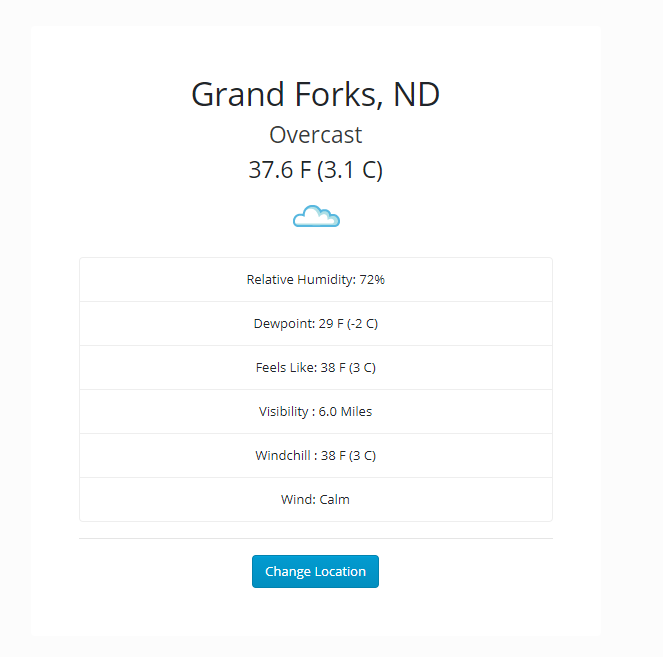

# Weatherjs
#### This application displays the current weather using the Wunderground weather API.
___

___
#### In order to use the app, You will need to obtain an API Key from Wunderground Weather. Open weather.js and insert your api
```javascript
this.apiKey = 'insert api key here';
```

## Author 
___
##### Richard David
## Version
___
##### 0.0.0.1
## License 
##### This project is licensed under MIT License 
